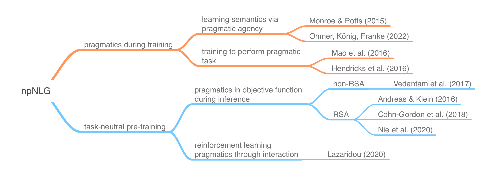
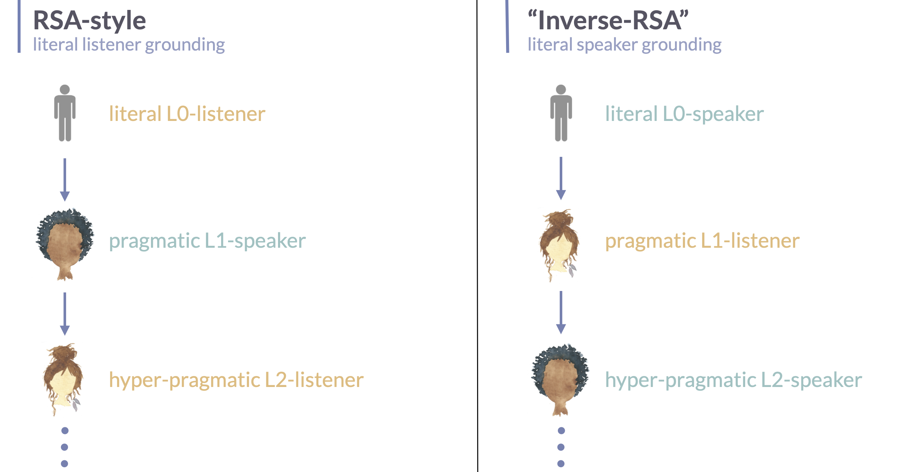

# Neural pragmatic Natural Language Generation

The final part of this course covers recent work that combines ideas from or similar to probabilistic models of pragmatic reasoning (like the RSA model family) with neural natural language generation.
The focus in on RSA-like ideas combined with neural image captioning models.

The goal of injecting RSA-like ideas into neural NLG is to separate a context-neutral (semantic) model component from a context-dependent (pragmatic) component.
This can mean different things.
For one, it can mean learning a (contextually stable) semantic meaning representation through the lens of a generation model that approximates pragmatic language use in context (e.g., Monroe & Potts 2015, Ohmer et al. 2022).
For another, it can mean making a system that was trained in a task-neutral way more contextually flexible, e.g., by using simple image captioning data and yet coercing system generations to respond to context-dependent relevance of information.

Combining probabilistic pragmatics and NLG essentially means taking a numerical measure of &ldquo;pragmatic goodness&rdquo;, e.g., contextual informativity, feeding it into the NLG model.
This can happened at two places: (i) during training as (part of) the training objective, or (ii) during inference as (part of) the decoding scheme.
The measure of &ldquo;pragmatic goodness&rdquo; can be more or less closely aligned with the models used in the RSA literature.
Different measures can also affect training or decoding efficiency.
The following diagram shows examples for these two strands of reasoning, classifying some prominent papers from the recent literature.

Some of the models we look implement the previously introduced &ldquo;classic&rdquo; RSA sequence (literal listener, pragmatic speaker, pragmatic listener), e.g., Monroe & Potts (2015), Ohmer, König & Franke (2022), Andreas & Klein (2016).
Other works rather use the &ldquo;inverse&rdquo; RSA sequence, which grounds out in a literal speaker, e.g., Vedantam et al. (2017), Cohn-Gordon et al. (2018), Nie et al. (2020).
The latter is often easier to work with as a &ldquo;literal speaker&rdquo; can be straightforwardly approximated with a task-neutral image captioner.

## Learning goals for this session

1.  become oriented in the landscape of pragmatic neural NLG
2.  understand different ways in which RSA(-like) ideas can be applied in NLG

## Slides

Here are the [slides for this session](<https://michael-franke.github.io/npNLG/09-pragmatic-NLG.pdf>).

## Papers

For course projects, the following papers are relevant as starting points for replication studies:

-   Andreas, J., & Klein, D. (2016). [Reasoning about pragmatics with neural listeners and speakers](https://arxiv.org/abs/1604.00562). In: Proceedings of the 2016 Conference on Empirical Methods in Natural Language Processing (pp. 1173–1182).

-   Vedantam, R., Bengio, S., Murphy, K., Parikh, D., & Chechik, G. (2017). [Context-Aware Captions From Context-Agnostic Supervision](https://arxiv.org/abs/1701.02870). In: Proceedings of the IEEE Conference on Computer Vision and Pattern Recognition (CVPR) (pp. 251–260).

-   Cohn-Gordon, R., Goodman, N. D., & Potts, C. (2018). [Pragmatically informative image captioning with character-level inference](https://aclanthology.org/N18-2070/). In , Proceedings of NAACL (pp. 439–443).

-   Nie, A., Cohn-Gordon, R., & Potts, C. (2020). [Pragmatic Issue-Sensitive Image Captioning.](https://aclanthology.org/2020.findings-emnlp.173.pdf) In: Findings of the Association for Computational Linguistics: EMNLP 2020 (pp. 1924–1938).

Additional literature, not recommended as starting points for course projects is listed here:

-   Monroe, W., & Potts, C. (2015). [Learning in the Rational Speech Acts model](https://arxiv.org/abs/1510.06807). In: Proceedings of 20th Amsterdam Colloquium.

-   Ohmer, X., Franke, M., & König, Peter (2021). [Mutual exclusivity in pragmatic agents](http://dx.doi.org/https://doi.org/10.1111/cogs.13069). Cognitive Science, 46(1), 13069.

-   Hendricks, L. A., Akata, Z., Rohrbach, M., Donahue, J., Schiele, B., & Darrell, T. (2016). [Generating Visual Explanations](https://link.springer.com/chapter/10.1007/978-3-319-46493-0_1). In: Computer Vision &#x2013; ECCV 2016 (pp. 3–19).

-   Junhua Mao, Jonathan Huang, Alexander Toshev, Oana Camburu, Alan Yuille, & Kevin Murphy (2016). [Generation and comprehension of unambiguous object descriptions](https://arxiv.org/abs/1511.02283). In: 2016 IEEE Conference on Computer Vision and Pattern Recognition (CVPR) (pp. 11–20).

